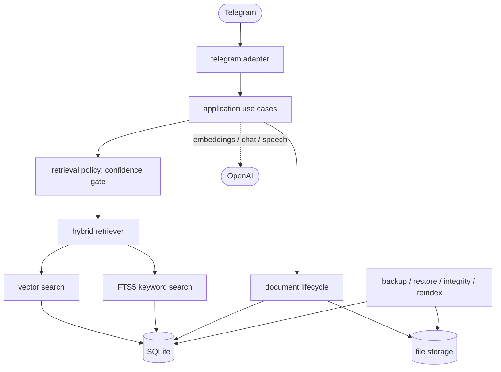

# ai-knowledge-assistant-tg-bot

Telegram bot for personal document Q&A. Upload a PDF, Markdown or text file, then ask questions (typed or spoken) and get answers grounded in **your own documents**, with numbered sources - or an honest "I couldn't find enough information" when the documents do not hold the answer.

Everything runs locally except the OpenAI calls: files live on disk; metadata, vectors and the full-text index live in one SQLite file. TypeScript, Telegraf, SQLite (WAL, FTS5). No vector database, queue or other service.

## Features

- **Hybrid retrieval** - semantic vector search *and* SQLite FTS5 keyword search, fused with reciprocal rank fusion; exact identifiers (`E-4012`, `ECONNRESET`, `v2.14.1`) get extra evidence.
- **Answers only with evidence** - a deterministic confidence gate runs *before* the chat model. `RETRIEVAL_CONFIDENCE_MODE=shadow` (the default) decides and logs but **never changes a reply**; `enforce` refuses weak evidence without calling the model - switch only after validating on real embeddings ([docs/rag.md](docs/rag.md#rolling-out-the-gate)).
- **Citations you can follow** - PDF pages, Markdown sections or chunk numbers; references to sources that do not exist are removed.
- **Document lifecycle** - identical uploads recognised by content hash, `/replace` that never leaves a document half-indexed, index health, re-embed / re-chunk workflows.
- **Operable** - integrity check with a deep full-text verification, safe repair, **backup, verified restore**, diagnostics, SQLite maintenance, structured logs, graceful shutdown.
- **Safe by default** - strict per-user isolation (enforced by the schema too), server-generated file names, file-type validation, bounded inputs, secrets scrubbed from every output ([docs/security.md](docs/security.md)).
- **Offline evaluation** - Recall@K / MRR, answerability confusion matrix, calibration/validation split, regression gate; no API key needed.

## Architecture



Dependencies point inwards (`telegram/` -> `application/` -> `core/`; `infrastructure/` implements the ports; `composition-root.ts` wires it) and `test/architecture.test.ts` enforces it. Details: [docs/architecture.md](docs/architecture.md) · RAG pipeline: [docs/rag.md](docs/rag.md).

## Quick start

Node.js **22.12+ or 24** (`.nvmrc`).

```bash
git clone <repo> && cd <repo>
npm ci
npm run check                 # typecheck, tests, build, smoke - no credentials, no network
cp .env.example .env          # set TELEGRAM_BOT_TOKEN and OPENAI_API_KEY
npm start                     # node dist/index.js      (development: npm run dev)
```

## Docker

```bash
docker build -t telegram-rag-bot .
docker run -d --name rag-bot --init --restart unless-stopped --env-file .env -v rag-bot-data:/data telegram-rag-bot
```

Multi-stage Debian-slim image, non-root user, production dependencies only, no secrets baked in. All data lives in the `/data` volume (`app.db` + `files/`). `docker compose up -d --build` does the same. Persistence, shutdown, health signals: [docs/operations.md](docs/operations.md#docker).

## Bot commands

`/start`, `/help` · `/list` (documents with id, size, date, state) · `/doc <id>` (details) · `/ask <question>` or plain text · `/summary <id>` · `/delete <id>` · `/replace <id>` (send the new file with the caption `/replace <id>`). Sending a file uploads it; a voice message asks a question.

## Operating it

Operational commands run **compiled code** (`npm run build` first) and need no API key or bot token:

```bash
npm run integrity [-- --repair]                   # deep, read-only check; --repair = safe, verified fixes only
npm run backup -- --output ./backups/x            # consistent snapshot: database + originals + manifest (no secrets)
npm run backup:verify -- ./backups/x              # manifest, hashes, database, integrity
npm run restore -- --from ./backups/x [--dry-run] [--replace-existing]
npm run diagnostics                               # versions, counts, health - safe for bug reports
npm run db:maintenance                            # SQLite integrity_check (+ --checkpoint / --optimize / --vacuum)
npm run reindex -- --dry-run                      # which documents are stale, and why
```

**Backup and restore.** A restore verifies the backup, builds and migrates a candidate in a staging directory, runs the full integrity check on it and only then activates it - one atomic rename. It refuses to replace an installation that holds data without `--replace-existing`, keeps the replaced one, and leaves the live data untouched on any failure. Formats, atomicity and failure semantics, the SQLite settings, upgrades and worked scenarios (deployment, restart, recovery, hostile file name, damaged index): [docs/operations.md](docs/operations.md).

## Configuration

Copy `.env.example`; each command validates only what it uses.

| Variable | Default | |
| --- | --- | --- |
| `TELEGRAM_BOT_TOKEN`, `OPENAI_API_KEY` | required by the bot | credentials (environment only) |
| `DATA_DIR` | `data` (`/data` in Docker) | `app.db` and `files/` |
| `OPENAI_CHAT_MODEL` / `OPENAI_EMBEDDINGS_MODEL` | `gpt-4.1-mini` / `text-embedding-3-small` | changing the embeddings model: `npm run reindex` |
| `RETRIEVAL_CONFIDENCE_MODE` | `shadow` | `off`, `shadow`, `enforce` |
| `MAX_UPLOAD_BYTES`, `MAX_DOCUMENTS_PER_USER`, `MAX_STORAGE_BYTES_PER_USER`, `MAX_CHUNKS_PER_DOCUMENT`, `MAX_PDF_PAGES` | 10 MB, 100, 200 MB, 2000, 1000 | bounds |
| `RATE_LIMIT_REQUESTS` / `RATE_LIMIT_WINDOW_MS` | `10` / `60000` | per user |
| `LOG_LEVEL`, `LOG_QUESTIONS`, `RAG_DEBUG` | `info`, `false`, `false` | logging: [what may be logged](docs/security.md#what-may-be-logged) |

Everything else (chunking, retrieval depth, thresholds, timeouts, feedback buttons): `.env.example`.

## Testing and evaluation

```bash
npm run typecheck && npm test         # 1,300+ tests; real SQLite, no network, never OpenAI or Telegram
npm run smoke                         # the whole lifecycle through the compiled application, offline providers
npm run smoke:cli                     # the operational commands from compiled code, without credentials
npm run test:coverage                 # coverage as a diagnostic (no threshold)
npm run eval:retrieval                # Recall@K, MRR, answerability (offline, deterministic)
npm run eval:confidence               # confidence-gate calibration on the calibration split
npm run test:retrieval                # regression gate against eval/baseline.json
npm run eval:retrieval:live           # real embeddings: prints the plan; costs money only with --confirm-spend
```

CI (`.github/workflows/ci.yml`) runs the deterministic checks on Node 24 and 22, the Docker image checks and a dependency audit - no secrets. Offline numbers, method and limits: [docs/evaluation.md](docs/evaluation.md).

## Project docs

[docs/architecture.md](docs/architecture.md) (layers, schema, lifecycle, failure semantics) · [docs/rag.md](docs/rag.md) (pipeline, gate, provenance) · [docs/evaluation.md](docs/evaluation.md) · [docs/operations.md](docs/operations.md) (run, Docker, backup/restore, scenarios) · [docs/security.md](docs/security.md) (threat model, logging rule)

## Known limitations

- Semantic search is a brute-force scan of one user's vectors (thousands of chunks, not millions); the `VectorStore` port is the seam for an ANN index.
- The confidence gate's similarity threshold (0.5) was calibrated on synthetic embeddings and is **not validated against real embeddings** - hence `shadow` by default.
- No OCR (scanned PDFs are rejected); PDF citations use physical page indexes.
- Single process (SQLite file, long polling); the rate limit is in memory and resets on restart.
- Backups are not encrypted and contain every user's documents; the host is trusted storage ([threat model](docs/security.md)).
