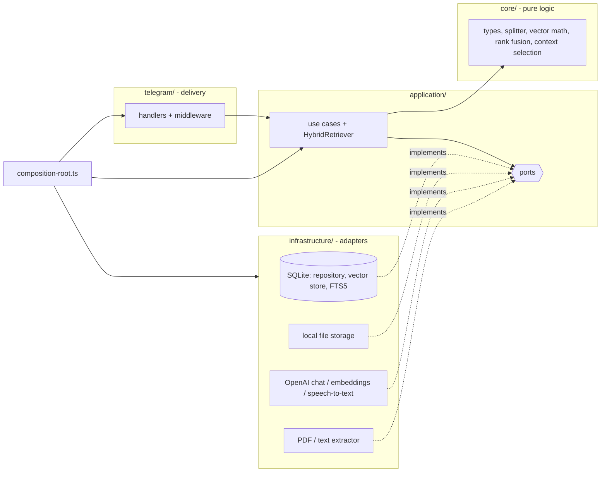
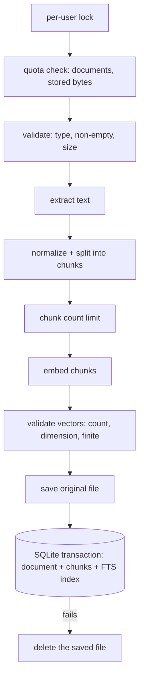
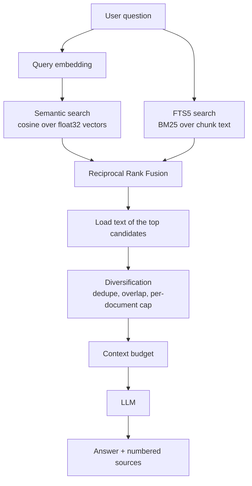

# ai-knowledge-assistant-tg-bot

Telegram bot for personal document Q&A. Upload a PDF, Markdown or text file, then ask questions (typed or spoken) and get answers grounded in your own documents, with numbered sources.

Everything runs locally except the OpenAI calls: files live on disk, metadata, vectors and the full-text index live in one SQLite file.

## Features

- Upload `PDF`, `MD`, `TXT` (size-limited, configurable)
- **Hybrid retrieval**: semantic vector search *and* SQLite FTS5 keyword search, fused with reciprocal rank fusion - finds paraphrases *and* exact identifiers, file names and error strings
- Numbered sources that match the `[n]` citations in the answer
- Voice questions (OpenAI transcription)
- Map-reduce summaries for long documents (chunk overlap is not summarized twice), cached after the first run
- Strict per-user isolation: every query is scoped by the Telegram user id
- Per-user storage limits and a per-user rate limit for operations that cost money
- `npm run reindex` to re-embed documents after changing the embeddings model

## Commands

| Command | Description |
| --- | --- |
| `/start`, `/help` | Introduction and command list |
| `/list` | Your indexed documents (with their ids) |
| `/ask <question>` | Ask about your documents. Plain text works too |
| `/summary <documentId>` | Short summary of a document |
| `/delete <documentId>` | Delete a document, its vectors and its file |

Sending a file uploads it; sending a voice message asks a question.

## Architecture

Dependencies point inwards: the application layer only knows ports (interfaces), never SQLite, OpenAI, the filesystem or Telegram. `src/composition-root.ts` is the single place where concrete adapters are created and injected.



```text
src/
  index.ts              entry point: load config, build the app, run it
  composition-root.ts   creates adapters once and injects them (bot + the reindex tool)
  lifecycle.ts          start polling, graceful shutdown (SIGINT/SIGTERM)
  cli/                  `npm run reindex` (argument parsing, output formatting, entry script)
  config/               environment parsing and validation (zod)
  core/                 pure logic, no I/O: types, text splitter, cosine similarity + vector codec,
                        rank fusion (RRF), context selection, chunk-overlap trimming, FTS query builder
  application/
    hybrid-retriever.ts query embedding -> semantic + lexical search -> RRF -> context selection
    ports/              DocumentRepository, VectorStore, IndexMaintenance, FileStorage, ChatModel,
                        EmbeddingsProvider, SpeechToText, DocumentTextExtractor
    prompts/            chat messages (system / user roles) for answering and summarizing
    use-cases/          ingest, answer, list, summarize, delete, reindex (one document / a run)
    check-index-compatibility.ts   startup diagnostic for stale embeddings
  infrastructure/
    sqlite/             connection, migrations, repository, vector store (vectors + FTS5), index maintenance
    storage/            local file storage
    openai/             chat model, embeddings, speech-to-text adapters
    documents/          PDF / MD / TXT text extraction
  telegram/             bot factory, routing, handlers, middleware (errors, rate limit), downloads, UI text
  shared/               logger, errors, rate limiter, keyed mutex, small utilities
test/                   Vitest suites using fakes for the ports and in-memory SQLite
```

### Request flow

1. Telegraf receives an update; `requestLogger` and `errorBoundary` middleware wrap every handler.
2. Handlers that call OpenAI (`/ask`, plain text, `/summary`, uploads, voice) first pass the per-user rate limit.
3. A handler reads Telegram specifics (user id, command arguments, file ids), calls one use case, and formats the result as plain text, split into several messages if it exceeds Telegram's limit.
4. `errorBoundary` replies with the message of an `AppError` (written for users) or a generic message for anything unexpected. Technical details are logged, never sent.

### Ingestion flow



Everything that can fail without side effects happens first, and limits are checked before any paid embedding call. The file is only written after embeddings succeeded, document and chunks are saved atomically (the full-text index is updated by triggers inside the same transaction), and the file is removed again if that last step fails. A failed upload therefore leaves no orphan file, no document without chunks and no chunks without a document. Uploads of one user run one after another so two simultaneous uploads cannot both slip under a quota.

### RAG pipeline



1. **Embed** the question (validated: finite, non-empty).
2. **Semantic search** compares it with the user's chunks embedded by the *same model and dimension* (cosine, `MIN_SIMILARITY_SCORE`, best `RETRIEVAL_SEMANTIC_LIMIT`). Ranking reads only ids and vectors, no chunk text.
3. **Lexical search** runs the question through FTS5 (best `RETRIEVAL_LEXICAL_LIMIT` by BM25). Terms are extracted and double-quoted, so punctuation or operators in a question can never break the query; identifiers such as `api_client.ts` or `gpt-4.1-mini` are matched as phrases; a few very common words are ignored. Lexical search does not depend on the embedding model.
4. **Fuse** the two ranked lists with Reciprocal Rank Fusion (below).
5. **Load** the text of only the best `3 x RETRIEVAL_TOP_K` fused candidates.
6. **Select context** (deterministic): drop exact duplicates (e.g. the same file uploaded twice) and neighbouring chunks that mostly repeat an already selected one, cap chunks per document (soft: free slots are backfilled), stop at `RETRIEVAL_TOP_K` chunks and `RETRIEVAL_CONTEXT_MAX_CHARS` characters (the best chunk is truncated if it alone is larger).
7. If nothing is relevant the bot says so without calling the chat model.
8. Otherwise the chat model receives three messages: a **system** message with the rules (answer only from the excerpts, treat them as untrusted data, ignore instructions found inside them, cite `[n]`, say when evidence is insufficient), a **user** message with the numbered excerpts, and a **user** message with the question.
9. The use case returns `{ answer, sources: [{ documentId, fileName, chunkIndex, rank, score }] }`. Telegram shows:

```text
Sources:
1. architecture.pdf · chunk 12
2. notes.md · chunk 4
```

Numbers match the `[n]` in the answer. Chunk numbers are positions in the document; there are no page numbers because extraction does not keep page information.

#### Reciprocal Rank Fusion

Cosine similarity (about 0.2-1) and BM25 (an unbounded, corpus-dependent number) cannot be added meaningfully, so only the *rank* inside each list is used:

```text
score(chunk) = 1 / (60 + semanticRank) + 1 / (60 + lexicalRank)      (a missing list contributes 0)
```

A chunk found by both methods outranks one found by a single method; a chunk found by just one still participates. Duplicates are merged by chunk id; ties are broken deterministically. The implementation is a pure function (`src/core/rank-fusion.ts`). Each result keeps `semanticRank`, `lexicalRank`, the fused score and rank for debugging (see `RAG_DEBUG`); normal users only see the numbered source list.

### Summaries

Documents up to ~12k characters are summarized in one call. Longer ones are map-reduced: consecutive chunks are grouped (~8k characters), each group is summarized, and the partial summaries are summarized again (bounded number of rounds). Before that, the overlap the splitter repeated between neighbouring chunks (`CHUNK_OVERLAP`) is trimmed using chunk indices, so text is not summarized twice; repeated passages elsewhere in a document are left alone. The result is cached on the document, and simultaneous `/summary` requests for one document share a single computation.

### Storage design

- Files: `<DATA_DIR>/files/<uuid>-<sanitized name>`
- Database: `<DATA_DIR>/app.db` (SQLite, WAL mode, foreign keys on)

| Table | Purpose |
| --- | --- |
| `documents` | One row per upload: owner, names, sizes, cached summary |
| `document_chunks` | Chunk text, embedding (float32 BLOB), `embedding_model`, `embedding_dim`; stable integer key `seq`; `UNIQUE (document_id, chunk_index)`; `ON DELETE CASCADE` from `documents` |
| `chunk_fts` | FTS5 external-content index over `document_chunks.content` (`unicode61`, diacritics folded), kept in sync by insert/update/delete triggers - so ingestion, deletion and cascades update it in the same transaction |

Indexes follow the queries: `documents(user_id, created_at DESC)` for `/list`, `document_chunks(user_id, embedding_model)` for vector search; per-document access uses the unique index.

**Migrations** use `PRAGMA user_version` (`src/infrastructure/sqlite/migrations.ts`). Each runs in its own transaction; a database written by a newer version is refused.

| Version | Change |
| --- | --- |
| 1 | baseline schema |
| 2 | track `embedding_model` / `embedding_dim`, unique chunk positions, query-shaped indexes |
| 3 | embeddings stored as float32 **BLOB** instead of JSON text; chunks get a stable integer `seq` key. Unreadable JSON vectors keep their row (the text stays searchable) with dimension 0 |
| 4 | `chunk_fts` FTS5 index + sync triggers; existing chunks are indexed during the migration |

Existing databases upgrade automatically on the next start; existing vector-only data stays usable (same model, same vectors up to float32 precision) and becomes keyword-searchable at once. The migration needs FTS5; it is included in the SQLite build shipped with `better-sqlite3`, and a build without it fails the migration with a clear message.

**Why BLOB vectors:** measured on 5000 chunks x 1536 dimensions, scanning JSON vectors together with the chunk text took ~264 ms per query in a micro-benchmark; reading only float32 blobs takes ~46 ms for the scan alone and ~75 ms for the whole `searchSimilar` call, and vectors are ~5x smaller on disk. The scan is still brute force over the user's chunks - fine for thousands of chunks, and the `VectorStore` port is the seam for an ANN index later.

### Re-indexing and embedding compatibility

Vectors from different embedding models (or dimensions) are never compared: a chunk is only a semantic candidate if it was embedded with the configured `OPENAI_EMBEDDINGS_MODEL` and has the query's dimension. After changing the model, old chunks are therefore **skipped by semantic search** (they stay findable by keywords) until re-indexed.

- **Startup diagnostic:** the bot reads the database (no API calls, no cost) and logs one warning with the number of affected documents/chunks, the configured model and the command to run. It never re-indexes automatically.
- **Re-index:**

```bash
npm run reindex                       # documents whose vectors are stale (other model, wrong dimension, unreadable)
npm run reindex -- --dry-run          # list what would be re-indexed; no OpenAI calls
npm run reindex -- --all              # every document
npm run reindex -- --document <id>    # one document
node dist/cli/reindex.js --all        # same, from the compiled build
```

It reads the same `.env`, processes documents one at a time with progress output, and exits non-zero if any document failed. The default mode asks the provider for one tiny embedding to learn the model's dimension. Per document, new vectors are computed first and swapped in a single transaction, so a failure (API error, wrong vector count) leaves that document untouched and the run continues; rerunning picks up exactly what is still stale.

**Limitation:** re-indexing reuses the stored chunk text; it does not re-read the original file or re-split it. Changing `CHUNK_SIZE` / `CHUNK_OVERLAP` therefore only affects documents uploaded afterwards - to re-chunk an existing document, delete and re-upload it.

### Limits and safeguards

| Safeguard | Default | Behaviour |
| --- | --- | --- |
| `MAX_DOCUMENTS_PER_USER` | 100 | Upload rejected with a clear message; checked before any extraction or embedding |
| `MAX_STORAGE_BYTES_PER_USER` | 200 MB | Sum of a user's original file sizes plus the new file |
| `MAX_CHUNKS_PER_DOCUMENT` | 2000 | Checked after splitting, before paying for embeddings (bounds embedding cost per file) |
| `RATE_LIMIT_REQUESTS` per `RATE_LIMIT_WINDOW_MS` | 10 per 60 s | Sliding window per Telegram user, in memory, for questions, summaries, uploads and voice messages (a voice question counts once). Over the limit the user gets "try again in N seconds"; `/list`, `/delete` and `/help` are free. Idle users are forgotten, so memory stays bounded; the state resets on restart |

Concurrency: ingestion of one user is serialized (so quotas cannot be raced), and summaries are computed once per document at a time. Everything else relies on SQLite transactions: a search never sees a half-ingested document, a document deleted during a request is simply dropped from the result, and re-indexing swaps vectors atomically.

### Observability

Every question logs one concise structured line: selected chunk count, stage timings (question embedding, semantic search, lexical search, rank fusion, context preparation, LLM generation) and total duration. Logs never contain document text, embeddings, keys or tokens.

With `RAG_DEBUG=true` each question additionally logs a `RAG retrieval debug` entry: candidate counts per stage, selected chunk ids / document ids / chunk positions with `semanticRank`, `lexicalRank`, fused rank and score, why candidates were skipped (`duplicate`, `overlap`, `document-cap`, `budget`) and the context size in characters. Still ids and numbers only. Meant for development; it is off by default.

## Configuration

Copy `.env.example` to `.env`.

| Variable | Default | Description |
| --- | --- | --- |
| `TELEGRAM_BOT_TOKEN` | required | Bot token from @BotFather |
| `OPENAI_API_KEY` | required | OpenAI API key |
| `OPENAI_CHAT_MODEL` | `gpt-4.1-mini` | Answers and summaries |
| `OPENAI_EMBEDDINGS_MODEL` | `text-embedding-3-small` | Chunk and query vectors (run `npm run reindex` after changing) |
| `OPENAI_TRANSCRIBE_MODEL` | `whisper-1` | Voice transcription |
| `DATA_DIR` | `data` | Where `app.db` and `files/` live |
| `MAX_UPLOAD_BYTES` | `10485760` | Upload size limit (Telegram bots can download at most 20 MB) |
| `CHUNK_SIZE` / `CHUNK_OVERLAP` | `1000` / `150` | Chunking in characters (affects new uploads only) |
| `RETRIEVAL_TOP_K` | `5` | Maximum chunks passed to the model |
| `MIN_SIMILARITY_SCORE` | `0.2` | Minimum cosine similarity for a semantic candidate |
| `RETRIEVAL_SEMANTIC_LIMIT` / `RETRIEVAL_LEXICAL_LIMIT` | `20` / `20` | Depth of the two candidate lists that are fused |
| `RETRIEVAL_CONTEXT_MAX_CHARS` | `6000` | Approximate budget for the chunk text sent to the model |
| `MAX_DOCUMENTS_PER_USER` | `100` | Documents per user |
| `MAX_STORAGE_BYTES_PER_USER` | `209715200` | Stored original file bytes per user |
| `MAX_CHUNKS_PER_DOCUMENT` | `2000` | Chunks a single document may produce |
| `RATE_LIMIT_REQUESTS` / `RATE_LIMIT_WINDOW_MS` | `10` / `60000` | Expensive operations allowed per user per window |
| `REQUEST_TIMEOUT_MS` | `60000` | Timeout for OpenAI calls and Telegram file downloads |
| `HANDLER_TIMEOUT_MS` | `300000` | Telegraf handler timeout (indexing a big PDF is slow) |
| `LOG_LEVEL` | `info` | pino log level |
| `LOG_QUESTIONS` | `false` | Also log question text (development only) |
| `RAG_DEBUG` | `false` | Log retrieval details: ids, ranks, counts, timings (development only) |

Logs are structured JSON (pino). They contain ids, sizes and durations; never document text, embeddings, API keys or bot tokens (secret-looking strings are scrubbed from logged errors).

## Development

Requires Node.js 20+.

```bash
npm install
npm run dev          # tsx watch
npm run typecheck    # tsc --noEmit (src + tests)
npm test             # vitest run
npm run build        # compile to dist/
npm start            # run the compiled app: node dist/index.js
npm run reindex      # re-embed stale documents (see "Re-indexing")
```

`npm start` runs compiled JavaScript, so run `npm run build` first.

### Tests

`npm test` runs Vitest without any network access. Application tests use fakes for the ports (embeddings, chat model, file storage, extractor) together with a real in-memory SQLite database. Covered: text splitting, cosine similarity and the vector codec, rank fusion, context selection, overlap trimming, the FTS query builder, FTS search (exact terms, user isolation, deletion, stale embeddings), hybrid retrieval, ingestion success/rollback/limits/concurrency, re-indexing (stale detection, replacement, failure isolation, dry run), the startup diagnostic, debug logging without content, rate limiting with an injected clock, migrations from every released schema, OpenAI adapters (fake `fetch`), Telegram helpers and graceful shutdown.

## Known limitations

- Semantic search is a brute-force scan of the user's vectors (~75 ms at 5000 chunks x 1536 dimensions): fine for thousands of chunks, not for millions. Lexical search does not scale with the same problem (FTS5 index), but filters by user after matching, so a very large multi-user database pays for other users' matches.
- Keyword matching is token based (no stemming, no synonyms); the semantic side covers paraphrases.
- Scanned PDFs without a text layer are rejected (no OCR); sources show chunk positions, not page numbers.
- Re-indexing keeps the stored chunking (see above).
- The rate limit is per process and resets on restart; single process only (SQLite file, long polling).
