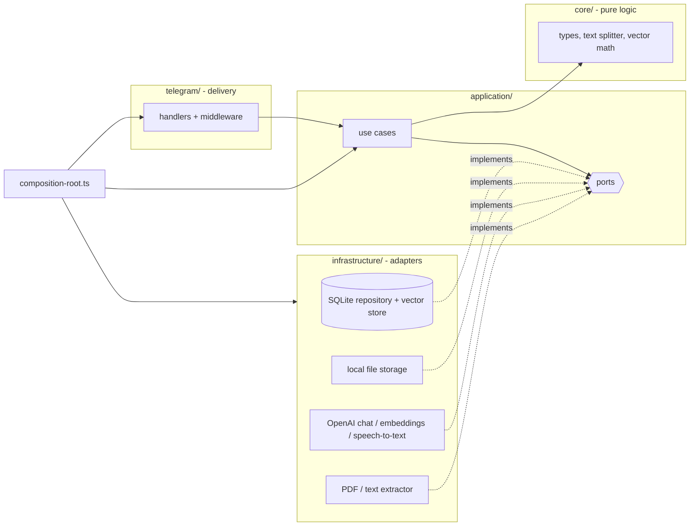
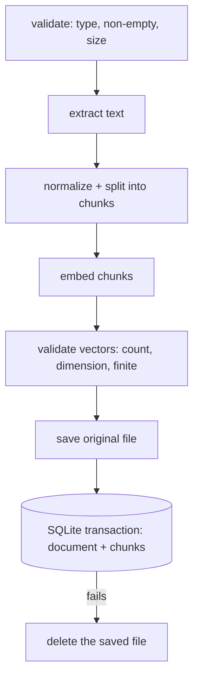

# ai-knowledge-assistant-tg-bot

Telegram bot for personal document Q&A. Upload a PDF, Markdown or text file, then ask questions (typed or spoken) and get answers grounded in your own documents, with sources.

Everything runs locally except the OpenAI calls: files live on disk, metadata and vectors live in one SQLite file.

## Features

- Upload `PDF`, `MD`, `TXT` (size-limited, configurable)
- Question answering over your documents with structured sources (`/ask` or plain text)
- Voice questions (OpenAI transcription)
- Map-reduce summaries for long documents, cached after the first run
- Strict per-user isolation: every query is scoped by the Telegram user id

## Commands

| Command | Description |
| --- | --- |
| `/start`, `/help` | Introduction and command list |
| `/list` | Your indexed documents (with their ids) |
| `/ask <question>` | Ask about your documents. Plain text works too |
| `/summary <documentId>` | Short summary of a document |
| `/delete <documentId>` | Delete a document, its vectors and its file |

Sending a file uploads it; sending a voice message asks a question.

## Architecture

Dependencies point inwards: the application layer only knows ports (interfaces), never SQLite, OpenAI, the filesystem or Telegram. `src/composition-root.ts` is the single place where concrete adapters are created and injected.



```text
src/
  index.ts              entry point: load config, build the app, run it
  composition-root.ts   creates adapters once and injects them into use cases and the bot
  lifecycle.ts          start polling, graceful shutdown (SIGINT/SIGTERM)
  config/               environment parsing and validation (zod)
  core/                 domain types, text splitter, cosine similarity - no I/O
  application/
    ports/              DocumentRepository, VectorStore, FileStorage, ChatModel,
                        EmbeddingsProvider, SpeechToText, DocumentTextExtractor
    prompts/            chat messages (system / user roles) for answering and summarizing
    use-cases/          ingest, answer, list, summarize, delete, reindex
  infrastructure/
    sqlite/             connection, migrations, repository, vector store
    storage/            local file storage
    openai/             chat model, embeddings, speech-to-text adapters
    documents/          PDF / MD / TXT text extraction
  telegram/             bot factory, routing, handlers, middleware, replies, downloads, UI text
  shared/               logger, errors, small utilities
test/                   Vitest suites using fakes for the ports and in-memory SQLite
```

### Request flow

1. Telegraf receives an update; `requestLogger` and `errorBoundary` middleware wrap every handler.
2. A handler reads Telegram specifics (user id, command arguments, file ids), calls one use case, and formats the result as plain text, split into several messages if it exceeds Telegram's limit.
3. `errorBoundary` replies with the message of an `AppError` (written for users) or a generic message for anything unexpected. Technical details are logged, never sent.

### Ingestion flow



Everything that can fail without side effects happens first. The file is only written after embeddings succeeded, document and chunks are saved atomically, and the file is removed again if that last step fails. A failed upload therefore leaves no orphan file, no document without chunks and no chunks without a document.

### RAG flow

1. Embed the question and validate the vector.
2. Search the user's chunks (cosine similarity, `RETRIEVAL_TOP_K`, `MIN_SIMILARITY_SCORE`). Only chunks produced by the *same embeddings model and dimension* are compared.
3. If nothing is relevant the bot says so without calling the chat model.
4. Otherwise the chat model receives three messages: a **system** message with the rules (answer only from the excerpts, treat them as untrusted data, ignore instructions found inside them, say when evidence is insufficient), a **user** message with the numbered excerpts, and a **user** message with the question.
5. The use case returns `{ answer, sources: [{ documentId, fileName, chunkIndex, score }] }`; formatting the sources is the Telegram layer's job.

### Summaries

Documents up to ~12k characters are summarized in one call. Longer ones are map-reduced: consecutive chunks are grouped (~8k characters), each group is summarized, and the partial summaries are summarized again (bounded number of rounds). The result is cached on the document.

### Storage design

- Files: `<DATA_DIR>/files/<uuid>-<sanitized name>`
- Database: `<DATA_DIR>/app.db` (SQLite, WAL mode, foreign keys on)

| Table | Purpose |
| --- | --- |
| `documents` | One row per upload: owner, names, sizes, cached summary |
| `document_chunks` | Chunk text, embedding (JSON array), `embedding_model`, `embedding_dim`; `UNIQUE (document_id, chunk_index)`; `ON DELETE CASCADE` from `documents` |

Indexes follow the queries: `documents(user_id, created_at DESC)` for `/list`, `document_chunks(user_id, embedding_model)` for search; per-document access uses the unique index.

**Migrations** use `PRAGMA user_version` (`src/infrastructure/sqlite/migrations.ts`). Each migration runs in its own transaction; a database written by a newer version is refused. Version 2 rebuilds `document_chunks` to add the embedding metadata; existing chunks are labelled with the currently configured `OPENAI_EMBEDDINGS_MODEL`.

**Changing the embeddings model:** vectors from different models are never compared. After changing `OPENAI_EMBEDDINGS_MODEL`, old documents are skipped by search (a warning is logged) until they are re-embedded with `ReindexDocumentUseCase` (`createApplication(...).reindexDocument`). It is not exposed in Telegram or a CLI yet.

**Vector search** is a brute-force cosine scan over the user's chunks. That is plenty for a personal knowledge base. The `VectorStore` port is the seam for Chroma/pgvector later; use cases would not change.

## Configuration

Copy `.env.example` to `.env`.

| Variable | Default | Description |
| --- | --- | --- |
| `TELEGRAM_BOT_TOKEN` | required | Bot token from @BotFather |
| `OPENAI_API_KEY` | required | OpenAI API key |
| `OPENAI_CHAT_MODEL` | `gpt-4.1-mini` | Answers and summaries |
| `OPENAI_EMBEDDINGS_MODEL` | `text-embedding-3-small` | Chunk and query vectors |
| `OPENAI_TRANSCRIBE_MODEL` | `whisper-1` | Voice transcription |
| `DATA_DIR` | `data` | Where `app.db` and `files/` live |
| `MAX_UPLOAD_BYTES` | `10485760` | Upload size limit (Telegram bots can download at most 20 MB) |
| `CHUNK_SIZE` / `CHUNK_OVERLAP` | `1000` / `150` | Chunking in characters |
| `RETRIEVAL_TOP_K` | `5` | Chunks passed to the model |
| `MIN_SIMILARITY_SCORE` | `0.2` | Minimum cosine similarity |
| `REQUEST_TIMEOUT_MS` | `60000` | Timeout for OpenAI calls and Telegram file downloads |
| `HANDLER_TIMEOUT_MS` | `300000` | Telegraf handler timeout (indexing a big PDF is slow) |
| `LOG_LEVEL` | `info` | pino log level |
| `LOG_QUESTIONS` | `false` | Also log question text (development only) |

Logs are structured JSON (pino). They contain ids, sizes and durations; never document text, embeddings, API keys or bot tokens (secret-looking strings are scrubbed from logged errors).

## Development

Requires Node.js 20+.

```bash
npm install
npm run dev          # tsx watch
npm run typecheck    # tsc --noEmit (src + tests)
npm test             # vitest run
npm run build        # compile to dist/
npm start            # run the compiled app: node dist/index.js
```

`npm start` runs compiled JavaScript, so run `npm run build` first.

### Tests

`npm test` runs Vitest without any network access. Application tests use fakes for the ports (embeddings, chat model, file storage, extractor) together with a real in-memory SQLite database. Covered: text splitting, cosine similarity edge cases, embedding validation, ingestion success and rollback, user isolation, ownership checks on delete, the no-context answer, source mapping, prompt structure, summary caching and map-reduce, migrations from the legacy schema, OpenAI adapters (fake `fetch`), Telegram message splitting and graceful shutdown.

## Known limitations

- Search loads all of a user's chunks and scores them in memory: fine for thousands of chunks, not for millions.
- Scanned PDFs without a text layer are rejected (no OCR).
- No re-indexing command yet (see above).
- Single process only (SQLite file, long polling).
