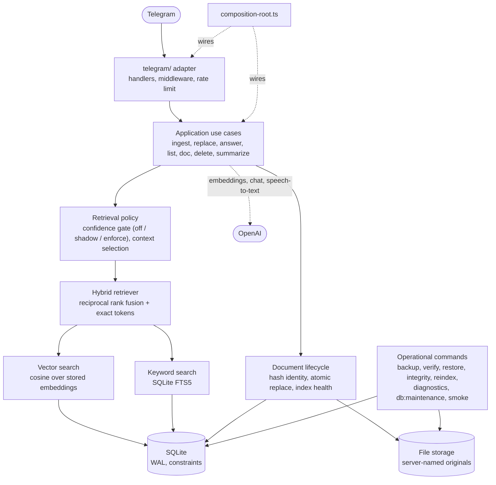
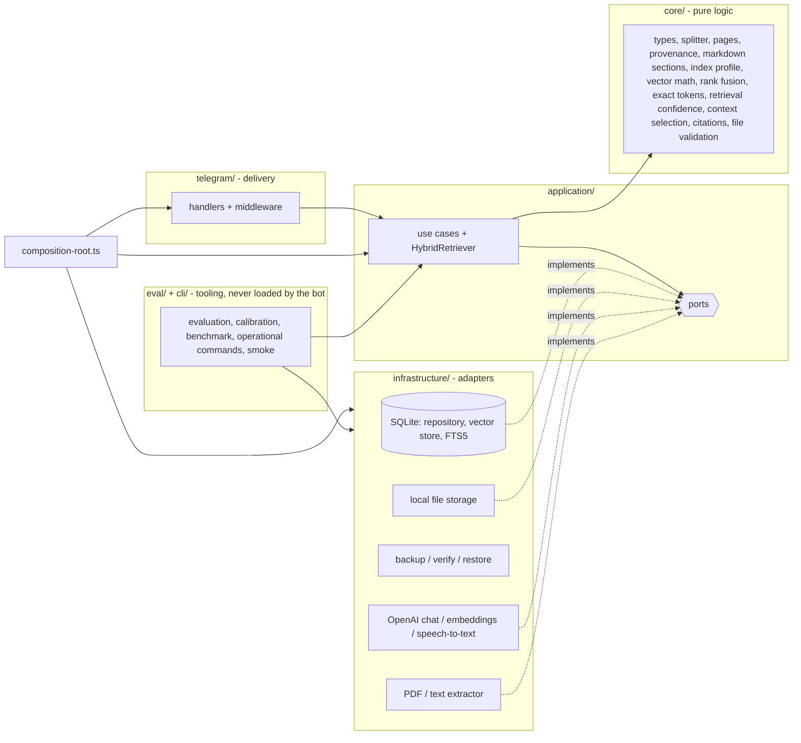

# Architecture

Dependencies point inwards: the application layer only knows ports (interfaces), never SQLite, OpenAI, the filesystem or Telegram. `src/composition-root.ts` is the single place where concrete adapters are created and injected. `test/architecture.test.ts` enforces the import rules (and that the bot's runtime never imports evaluation code).



The layers below are what the diagram's boxes are made of; dependencies point inwards and `test/architecture.test.ts` enforces it.



```text
src/
  index.ts              entry point of the bot (a few lines: startBot with the real dependencies)
  startup.ts            the logged start stages (config, database, storage, Telegram) and what happens when one fails
  composition-root.ts   creates adapters once and injects them: createCore (everything but Telegram; providers injectable - used by
                        the smoke command and the end-to-end tests), createApplication (bot), the reindex and integrity tools
  lifecycle.ts          start polling, graceful shutdown (SIGINT/SIGTERM)
  cli/                  command-line tools, compiled and run from dist: reindex, integrity, backup, backup-verify, restore, diagnostics,
                        db-maintenance, smoke, smoke-cli; development tooling (tsx): eval-retrieval (also eval:confidence), eval-diff, bench-retrieval
  config/               environment parsing in independent sections (zod); each command loads only what it needs
  core/                 pure logic, no I/O: types, text splitter (with offsets), page + Markdown-section provenance,
                        index profile, cosine similarity + vector codec, rank fusion (RRF) + exact-token bonus,
                        technical-token detection, retrieval signals + confidence gate (+ rollout modes), context selection,
                        chunk-overlap trimming, FTS query builder, citation checks and formatting, content hash,
                        index health, storage layout (temporary / orphan files), embedding batch size
  application/
    hybrid-retriever.ts query embedding -> semantic + lexical search -> RRF -> load -> exact-token bonus
                        -> evidence signals -> confidence gate -> context selection
    prepare-index.ts    extract -> split -> provenance -> embed (shared by ingestion and re-chunking)
    assess-index.ts     compares a document's recorded recipe with the configured one
    ports/              DocumentRepository, VectorStore, IndexMaintenance, IntegrityStore, FileStorage, FeedbackStore,
                        AnswerOutcomes, ChatModel, EmbeddingsProvider, SpeechToText, DocumentTextExtractor
    prompts/            chat messages (system / user roles) for answering and summarizing
    use-cases/          ingest, replace, answer, list, get (/doc), summarize, delete, reindex (re-embed), rechunk,
                        run-reindex, inspect-integrity, repair-integrity, record-feedback
    find-document-by-content.ts  duplicate lookup by content hash (with the lazy backfill of historical documents)
    describe-document-index.ts   index health of one existing document, from its record and chunk count
    document-overview.ts         health of a user's documents for /list and /doc
    check-index-compatibility.ts, startup-check.ts   the cheap startup diagnostics
  infrastructure/
    sqlite/             connection settings (+ read-only / maintenance opens, corruption classification), migrations, repository,
                        vector store (vectors + FTS5), index maintenance, integrity store (+ deep full-text check), feedback store, maintenance
    storage/            local file storage (atomic writes, temporary files)
    backup/             manifest (+ format versioning), create-backup (SQLite online backup), verify-backup, restore-backup, restore leftovers
    diagnostics/        the safe operator summary
    memory/             the bounded in-memory journal of answer outcomes
    openai/             chat model, embeddings, speech-to-text adapters
    documents/          PDF (per page) / MD / TXT text extraction
  eval/                 evaluation: metrics, answerability, calibration, dataset, harness, runner, comparison,
                        baseline, report, export, diff, live-run plan, benchmark
  telegram/             bot factory, routing, handlers, middleware (errors, rate limit), downloads, UI text
  shared/               logger (+ request ids), the secret scrubber, errors, rate limiter, keyed mutex, bounded retry, version, permissions, small utilities
eval/                   fixture corpus, questions (JSONL, versioned), comparison grids, baseline minimums, offline embedding lexicon
docs/                   this file, rag.md, evaluation.md, operations.md (run, Docker, backup/restore, scenarios), security.md (threat model, logging rule)
test/                   Vitest suites using fakes for the ports and in-memory SQLite
```

**Retrieval boundary.** `HybridRetriever` was inspected for a split into "retrieval" and "policy" and left as one class: `rank()` (search, fusion, loading, exact-token bonus, evidence signals) and `retrieve()` (adds the gate and context selection) share one set of dependencies and one ordering of steps, while the *decisions* already live in pure core functions (`assessRetrievalConfidence`, `selectContext`, `boostExactMatches`) that are tested and calibrated independently. A separate service would have been a wrapper. The evaluation uses `rank()` + `select()` + the same pure gate, so it measures the production path without a copy of it.

## Request flow

1. Telegraf receives an update; `requestContext` gives it a short opaque request id (8 random hex characters, never derived from user content) that the logger adds to every line logged while it is handled - handler, retrieval, generation, ingestion, feedback. `requestLogger` and `errorBoundary` wrap every handler.
2. `privateChatOnly` refuses shared chats and callbacks before document access or provider calls. Private updates run within an `Operations` deadline scope; handlers that call OpenAI (`/ask`, plain text, `/summary`, uploads, voice) also pass the per-user rate limit.
3. A handler reads Telegram specifics (user id, command arguments, file ids), calls one use case, and formats the result as plain text, split into several messages if it exceeds Telegram's limit.
4. `errorBoundary` replies with the message of an `AppError` (written for users) or a generic message for anything unexpected. Technical details are logged, never sent.

`HANDLER_TIMEOUT_MS` is an application deadline. Its `AbortSignal` follows the request through downloads, extraction and providers; embedding batches and summary calls check it between requests. SQLite mutations check cancellation immediately before publishing. A timeout sends one safe response and refuses later handler replies. Shutdown aborts updates and joins middleware, adapter cleanup and any file write/compensation already in progress before closing storage. Synchronous parsing/chunking still requires the existing input bounds; JavaScript timers cannot interrupt synchronous CPU work.

Semantic scanning runs in one worker thread against a read-only SQLite connection, with at most 16 queued/running jobs. Cancelled jobs remain counted until the worker acknowledges them. Scoring still costs O(ND), but top-K selection retains O(K) candidates and costs O(N log K); it does not sort or retain every qualifying match. Ranking and user/model/document filters match the in-process implementation used by evaluation fixtures. The `VectorStore` port remains the seam for ANN search if corpus size outgrows these bounds.

## Document lifecycle

```text
Upload
  |
hash (SHA-256 of the file's bytes, per user)
  |
duplicate? -- yes --> already-exists: the existing document, nothing extracted, embedded or stored
  |
  no
  |
quota -> extract -> chunk -> embed -> validate
                                |
                             persist (file, then one SQLite transaction)
                                |
                             indexed (created)


Replacement (/replace <id>, deliberately, by id):

old valid index
      |
prepare new index (extract, chunk, embed, validate)
      |
 success?
  |       |
 no      yes
  |       |
keep    write new file -> atomic swap (row + all chunks, one transaction)
old                            |
                          delete the old file (failure: logged, leaves an orphan)
```

**Identity.** A document's identity is the SHA-256 of its original bytes (`documents.content_hash`), looked up only among the *uploading user's* documents - another user's documents are never consulted, so nothing about them (existence, ownership, content) can be learned from an upload. A hash is never an authorization and never shown to a normal user. Two files with different names but identical bytes are one document; the same name with different bytes are two.

| Situation | Result | Effect |
| --- | --- | --- |
| same user, same bytes | `already-exists` | no extraction, no embedding call, no rows; quota is not consulted. Replies with the existing document (its own name), and says if its index is outdated or unusable. If the document's original file had gone missing, the upload writes it again and points the document at it (`restoredOriginal`) - still without re-indexing |
| same user, same name, other bytes | `created` | a second document with its own id; `/list` tells them apart by id, size and date |
| other user, same bytes | `created` | independent copy; no cross-user shortcut |
| `/replace <id>`, same bytes, index current | `already-exists` | nothing to do |
| `/replace <id>`, same bytes, index unusable | `replaced` | an explicit rebuild of that document |
| `/replace <id>`, bytes already stored as *another* document of the user | error naming that document | never creates two documents with one content |
| `/replace <id>` of someone else's / unknown id | "Document not found." | before anything is read, extracted, embedded or stored |

The ingestion result is a union: `created`, `already-exists` (with the index health of the existing document), and `replaced` (from the replace use case); Telegram decides how to word each. Uniqueness of `(user_id, content_hash)` is deliberately **not** a database constraint: historical duplicates are legitimate data, and a unique index would make the hash backfill and the migration fail on them. It is enforced by the use cases (serialized per user, one lock shared by ingest, replace and delete) and reported by `npm run integrity` (`duplicate-content`).

**Historical documents** (stored before hashes existed) have an unknown hash (`NULL`, never invented). On an upload, only that user's unhashed documents *of the same size* are read once and hashed - the hash is then persisted, so no file is read twice - and a missing file merely leaves the hash unknown. `npm run integrity -- --repair` backfills the rest.

**Replacement** is `/replace <documentId>` plus a file: since Telegram commands cannot carry a file, the file is sent *with the caption* `/replace <documentId>` (no conversation state to expire; a plain `/replace` explains this). The document keeps its id, owner and creation time, so citations and `/summary` links remain valid; its cached summary is cleared (it described the old content), the file name becomes the new upload's name, `document_version` increases, `previous_content_hash` keeps the hash before the swap and `updated_at` records the time. No history of older versions is kept.

```text
documents: content_hash  document_version  updated_at  previous_content_hash   (index_profile says what produced the chunks)
```

## Failure semantics: files and SQLite

SQLite cannot roll back a file write, so every workflow that crosses both uses one ordering - *prepare, commit the database, finalize the file, compensate if the commit fails* - and the database always wins:

| Workflow | Prepare (reads / paid work only) | Commit | Finalize | If the commit fails | If finalizing fails |
| --- | --- | --- | --- | --- | --- |
| ingest | validate, hash, extract, split, embed | write file, then one transaction (document + chunks + FTS) | - | delete the new file | - |
| replace | ownership, validate, hash, extract, split, embed | write new file, then one transaction swapping row + all chunks | delete the old file | delete the new file; the old document is untouched | log; the old file is an orphan (`integrity` reports it) |
| delete | ownership | delete the row (chunks cascade) | delete the file | nothing was changed | log; orphan file |
| re-chunk | read file, extract, split, embed | one transaction swapping all chunks + profile | - | old index untouched | - |
| restore a lost original (duplicate upload) | find the document by hash, `stat` the file | write the file, then update `stored_name` | - | delete the file just written; the upload is still reported as a duplicate | - |
| repair | inspect | only deterministic, free steps | - | reported as failed, the others still run | - |

A crash between "write file" and "commit" can only leave an *unreferenced* file, never a row without its file; `save` writes `.tmp-<uuid>.part` and renames it to `<uuid><ext>`, so even a crash mid-write leaves a recognisable temporary file instead of a truncated document. Failed work is never visible to users: the previous document and index stay usable until the new ones fully exist. Compensation failures are logged and never replace the original error.

## Index health

Health is **derived**, never stored (`src/core/index-health.ts`, pure), from the recorded profile, the chunks and the file system:

| State | Meaning | What questions do with it |
| --- | --- | --- |
| `current` | recipe matches the configuration, vectors readable, file present | everything |
| `embedding-stale` | other embedding model / dimension | semantic search skips these vectors (never compares incompatible ones); keyword search still finds the text |
| `chunking-stale` | other chunk size / overlap / algorithm | searchable as before (the index is internally consistent) |
| `extractor-stale` | older extraction (PDF without pages, Markdown without sections / Setext) | searchable; citations fall back to what the old index knows |
| `corrupt-index` | some vectors cannot be decoded | those chunks are skipped by semantic search (warned about), their text is still searchable by keyword |
| `missing-file` | the original is gone from storage | chunks stay searchable; re-chunk / re-extract is impossible until the file is restored |
| `unindexed` | no chunks | nothing to find |

Answering never repairs anything: it makes one query-embedding call and no write, whatever the state (a test pins this). Fixing a stale index is always an explicit, paid operator action (`npm run reindex`), never automatic. `/list` and `/doc` show the state in plain words (`ready`, `index outdated`, `partly unreadable`, `original file missing`, `not searchable`) and never hashes, fingerprints or dimensions.

## Integrity, repair and cleanup

`npm run integrity` is a **read-only** deep check: the database is opened with SQLite's read-only flag and is not migrated (an older schema is refused with a hint), so even a bug cannot write. It reports, per problem, what is wrong and the command that fixes it:

`missing-file`, `unreadable-file`, `file-size-mismatch`, `content-hash-mismatch` (reads every file; `--skip-hashes` for speed), `unknown-content-hash`, `duplicate-content`, `orphan-file`, `temporary-file`, `no-chunks`, `unreadable-embedding`, `mixed-dimensions`, `chunk-index-gap`, `foreign-chunk`, `orphan-chunks`, `fts-mismatch`, `fts-content-mismatch` and `fts-search-broken` (the deep full-text check), `interrupted-restore`, `previous-installation`, `database-corrupt` (SQLite's own checks) and `stale-index` - with a summary of how many documents need `npm run reindex` (re-embed) versus `npm run reindex -- --rechunk`. A Markdown document that predates section-aware extraction is named as such. The exit code is 1 when errors remain.

`npm run integrity -- --repair` applies only deterministic repairs that lose nothing and cost nothing, and prints exactly what it changed: rebuild the full-text index, record a missing content hash from the present original, delete **stale** temporary files (older than one hour, so a running upload is safe). `--remove-orphans` (with `--repair`) additionally deletes unreferenced stored files older than 24 hours. It never deletes documents or chunks, never regenerates embeddings, never replaces files, never guesses ownership and has no embeddings provider (an architecture test checks that the integrity, repair and backup code imports none).

Files in storage are classified by `src/core/storage-layout.ts` (pure, clock injected): **referenced** (a row points to it), **temporary** (`.tmp-*.part`, a write in progress or interrupted), **orphan** (no row). Age limits keep work in flight safe.

## Backup

```bash
npm run backup -- --output ./backups/before-upgrade     # default: ./backups/bot-backup-<UTC timestamp>
npm run backup:verify -- ./backups/before-upgrade
```

A backup is a directory: `app.db`, `files/<stored name>` (every original the snapshot refers to) and `manifest.json` (format version, schema version, counts, index profiles in use, size and SHA-256 of everything), written last - a directory without a manifest is not a finished backup, and a failed backup removes what it created. It never contains `.env`, API keys, the bot token or logs (it writes nothing but these three kinds of files; a test plants secrets and searches the output).

**Consistency.** The database is not copied as a file: in WAL mode recent commits live in a separate `-wal` file that a plain copy would miss or tear. The backup uses better-sqlite3's `db.backup()` (SQLite's online backup API), a point-in-time snapshot taken through SQLite itself, safe while the bot keeps writing (a test writes during the backup and checks that documents, chunks and the full-text index still agree). The snapshot is then made standalone (`journal_mode = DELETE`). The originals are copied afterwards for exactly the documents of that snapshot; a file deleted in between is listed in the manifest as missing.

`backup:verify` is read-only: manifest valid, database and every file match the recorded size and SHA-256, the database opens read-only and passes SQLite's structural check, every document's file is present (or recorded as already missing), recorded content hashes agree with the files, and the checks of `npm run integrity` run on the copy. Exit code 1 on any problem.

**Restore** (`npm run restore -- --from <backup>`) is verify -> stage -> migrate the candidate -> integrity-check the candidate -> activate, and never replaces an installation that holds data without `--replace-existing` (the replaced one is kept). The database file is the single, atomic commit point; every failure before it leaves the live installation untouched. Format versions, atomicity and failure semantics: [operations.md](operations.md#backup-and-restore).

## Startup

`startBot` logs the stages separately and stops at the first failure with a non-zero exit code: **config** (invalid configuration: nothing is created), **database** (open + migrate + structural check; a failed migration or a damaged file never reaches polling and the log carries advice on backup verification and restore), **storage** (the data directory must be readable and writable), **retrieval** (the confidence mode is logged), the cheap **startup check**, then **telegram** (command menu sync + polling start; on failure the database is closed). Nothing logs the configuration, the token or the key. The startup check logs counts only - documents, outdated indexes, missing originals, stale temporary files, orphan files - and points to `npm run integrity` for details; it never reads file contents, repairs or calls a provider, and a failing check never blocks the start.

## External calls

| Call | Retry | Why |
| --- | --- | --- |
| OpenAI embeddings and chat | SDK `maxRetries: 2` (429, 5xx, connection errors, honours `Retry-After`; never 4xx) | already bounded inside the client; wrapping it again would multiply paid calls |
| OpenAI speech-to-text | `withRetry`: 3 attempts, exponential backoff + jitter, `Retry-After` honoured (up to 10 s), abortable | a transcription is a pure function of the audio |
| Telegram file API / download | the same `withRetry` | idempotent, and the user has not been answered yet, so no duplicate reply |

Retried: 429, 408, 5xx (except 501/505), network resets and timeouts. Never retried: 400/401/403/404/413/422, a caller's abort, validation errors, anything unknown. **Embedding batches:** the LangChain client already batches in order and all-or-nothing (one failed batch fails the whole call, so a partial index cannot exist); the count is validated afterwards. The batch size is now set from the chunk size (`embeddingBatchSize`: at most 512 inputs, and few enough that one request stays under 250 000 tokens even if every character were a token) because the default 512 inputs of token-dense text (CJK) can exceed the provider's per-request token cap; for the default chunk size of 1000 characters a 2000-chunk document takes 8 requests instead of 4.

**Call counts, not prices.** Logs carry the number of provider calls an operation cost: ingestion and re-chunking `chunks` and `embeddingRequests`; a question `calls: { embedding, chat }` (an abstention is `chat: 0`); a summary `generationCalls`. No money is computed - prices are not configured.

## Database constraints (reviewed)

| Rule | Mechanism |
| --- | --- |
| a chunk belongs to an existing document; deleting a document removes its chunks and index entries | foreign key `ON DELETE CASCADE` (enabled on every connection) + FTS triggers |
| one chunk per position and per id | `UNIQUE (document_id, chunk_index)`, `UNIQUE (id)` |
| every document has an owner and a stored name | `NOT NULL` |
| full-text index follows the chunks | insert / update / delete triggers (checked by `integrity` against `chunk_fts_docsize`) |
| duplicate content per user | non-unique index `(user_id, content_hash)` for lookup; the rule is in the use cases (see above) |
| a chunk's owner equals its document's owner | composite foreign key `(document_id, user_id) REFERENCES documents(id, user_id)` (migration 9). `chunks.user_id` is kept, not derived by a join, because the search filters `WHERE user_id = ? AND embedding_model = ?` straight from `idx_chunks_user_model`; the constraint is what keeps that copy honest. `integrity` still reports `foreign-chunk` for a database written with foreign keys off |
| chunk position and vector dimension are not negative | `CHECK (chunk_index >= 0)`, `CHECK (embedding_dim >= 0)` (0 is how an unreadable vector is flagged) |
| feedback: one rating per user and answer, `good`/`bad` | `UNIQUE (request_id, user_id)`, `CHECK` |

`test/infrastructure/schema-constraints.test.ts` pins these. **Reviewed and deliberately left to application code:** document version >= 1 (`NOT NULL DEFAULT 1`; a `CHECK` on `documents` would need a rebuild of the parent table of the foreign keys, which is not worth it for a value only the use cases write), non-empty chunk text (the splitter never produces it, and legacy rows must not make a migration fail), timestamps (ISO strings written by the application), content-hash uniqueness per user (historical duplicates are legitimate data). Triggers were not added.

## Storage

- Files: `<DATA_DIR>/files/<uuid><ext>` - the name is generated by the server, the user's file name is only a database column (writes go through `.tmp-<uuid>.part` and a rename); database: `<DATA_DIR>/app.db` (SQLite, WAL, foreign keys on, see [operations.md](operations.md#sqlite-settings)).

| Table | Purpose |
| --- | --- |
| `documents` | One row per upload: owner, names, sizes, cached summary, `index_profile` (JSON) and `index_fingerprint`, `content_hash` (SHA-256, `NULL` = unknown), `document_version`, `updated_at`, `previous_content_hash` |
| `document_chunks` | Chunk text, embedding (float32 BLOB), `embedding_model`, `embedding_dim`, optional provenance (`page_start` / `page_end`, `page_label_start` / `page_label_end`, `section_path` as a JSON list of headings); stable integer key `seq`; `UNIQUE (document_id, chunk_index)`; `ON DELETE CASCADE` |
| `chunk_fts` | FTS5 external-content index over `document_chunks.content` (`unicode61`, diacritics folded), kept in sync by triggers |
| `answer_feedback` | Optional thumbs-up/down: request id, user, rating, and the confidence decision of that answer (labels and one number - no text) |

Migrations use `PRAGMA user_version` (`src/infrastructure/sqlite/migrations.ts`); each runs in its own transaction; a database written by a newer version is refused.

| Version | Change |
| --- | --- |
| 1 | baseline schema |
| 2 | track `embedding_model` / `embedding_dim`, unique chunk positions, query-shaped indexes |
| 3 | embeddings stored as float32 **BLOB** instead of JSON text; chunks get a stable integer `seq` key |
| 4 | `chunk_fts` FTS5 index + sync triggers; existing chunks are indexed during the migration |
| 5 | `documents.index_profile` / `index_fingerprint`, `document_chunks.page_start` / `page_end` (columns only, no data rewritten) |
| 6 | `document_chunks.section_path`, `page_label_start`, `page_label_end` - nullable, **no data rewritten**: older chunks have no section or label until their document is re-chunked, and a reader never invents one |
| 7 | `documents.content_hash` (unknown for existing rows), `document_version` (1), `updated_at`, `previous_content_hash`; non-unique index `(user_id, content_hash)` - **no data rewritten, no file read** |
| 8 | `answer_feedback` table |
| 9 | composite foreign key making a chunk's owner its document's owner, `CHECK`s on chunk position and dimension; the chunk table is rebuilt (same `seq` values, sequence preserved), the FTS triggers are recreated and the index rebuilt. It **refuses** (changing nothing, naming the documents) when existing data would violate the constraints - ownership is never guessed |

**Vector BLOB format** (`src/core/vectors.ts`): the IEEE-754 binary32 value of every dimension, 4 bytes each, **little-endian**, no header; the dimension is in `embedding_dim`. Values that do not fit float32 are rejected like `NaN`/`Infinity`. Scanning float32 blobs instead of JSON text cut a 5000 x 1536 scan from ~264 ms to ~46-75 ms and vectors are ~5x smaller. The scan is still brute force over the user's chunks - fine for thousands of chunks; the `VectorStore` port is the seam for an ANN index later.

## Index profile, re-embedding and re-chunking

Every document stores the **recipe it was indexed with** (`src/core/index-profile.ts`):

| Field | Changes when |
| --- | --- |
| `embeddingModel`, `embeddingDimension` | `OPENAI_EMBEDDINGS_MODEL` changes |
| `chunkSize`, `chunkOverlap` | `CHUNK_SIZE` / `CHUNK_OVERLAP` change |
| `chunkingVersion` | `splitText` behaves differently (a constant; bump it with the change) |
| `extractorVersion` | extraction output changes - per file type: `text-v1`, `markdown-sections-v2` (ATX + Setext headings, front matter skipped), `pdf-pages-v2` |

Query-time settings (`RETRIEVAL_*`, `MIN_SIMILARITY_SCORE`) are not part of it: they can change at any time without making stored data stale.

| Kind | Meaning | Effect on search | Fixed by |
| --- | --- | --- | --- |
| embedding | other model / dimension, or unreadable vectors | skipped by semantic search (still found by keywords) | `npm run reindex` (re-embed) |
| chunking | other chunk size, overlap or algorithm version | none | `npm run reindex -- --rechunk` |
| extractor | extraction changed (PDFs without pages, Markdown without sections) | none; citations fall back to chunk numbers | `npm run reindex -- --rechunk` |

Documents indexed before profiles existed have *unknown* chunk size/overlap; unknown is never reported as a change. The bot logs one warning at startup with the counts; it never re-indexes by itself. Re-chunking reads the stored file, extracts, splits, embeds, validates, and replaces chunks + profile in **one transaction**; any failure leaves the previous index untouched.

Migration 10 adds `documents.index_revision`, initialized to 1. Re-embedding and re-chunking read metadata, stable chunk ids and both revisions in one SQLite snapshot. Their publishing transaction checks `document_version` and `index_revision` before writing; replacement, re-chunking and re-embedding increment the index revision. A concurrent change or deletion rejects publication instead of applying vectors to a newer layout. Re-embedding also matches each update to its original chunk id.

```bash
npm run reindex -- --dry-run              # why is each document stale? No OpenAI calls, no API key
npm run reindex                           # re-embed documents with outdated embeddings
npm run reindex -- --rechunk              # also rebuild chunk-layout / extractor-stale documents from their files
npm run reindex -- --all --rechunk        # rebuild everything
npm run reindex -- --document <id> [--rechunk]
```

Documents are processed one at a time; one failure is recorded and the run continues; the exit code is non-zero if any document failed.

## Limits and safeguards

| Safeguard | Default | Behaviour |
| --- | --- | --- |
| `MAX_DOCUMENTS_PER_USER` | 100 | Upload rejected with a clear message before any extraction or embedding |
| `MAX_STORAGE_BYTES_PER_USER` | 200 MB | Sum of a user's original file sizes plus the new file |
| `MAX_CHUNKS_PER_DOCUMENT` | 2000 | Checked after splitting, before paying for embeddings; also applies when re-chunking and replacing |
| `MAX_CHUNKS_PER_USER` | 10000 | Total across the user's documents; checked before embeddings and again in the publishing transaction, crediting the old chunks on replacement/re-chunking |
| `MAX_PDF_PAGES` | 1000 | A PDF with more pages is refused before any text is extracted (a PDF of thousands of near-empty pages is small but slow to parse) |
| Markdown headings with section labels | 5000 | Above this no section labels are produced (the document is indexed and cited by chunk number): labelling compares every chunk with every heading, and 480,000 headings in 2 MB took ~23 s of uninterrupted CPU |
| `RATE_LIMIT_REQUESTS` per `RATE_LIMIT_WINDOW_MS` | 10 per 60 s | Sliding window per Telegram user, in memory, for questions, summaries, uploads and voice messages |

The rate limiter is in memory and per process on purpose (single-process long-polling bot, no Redis); it sits behind a small boundary (`src/shared/rate-limiter.ts`, injectable clock). Ingestion of one user is serialized; summaries are computed once per document at a time; everything else relies on SQLite transactions.

## Observability

Every line logged while an update is handled carries its `requestId` (8 hex characters, random) so one update can be followed through handler, retrieval, generation, ingestion and feedback. Every question logs one concise structured line: selected chunk count, stage timings and total duration. An abstained question logs `Question not answered: insufficient evidence` with the reason and the evidence numbers (no text). Logs never contain document text, embeddings, keys or tokens; the question itself only with `LOG_QUESTIONS=true`. With `RAG_DEBUG=true` each answered question also logs candidate counts, selected chunk ids with `semanticRank` / `lexicalRank` / fused rank, why candidates were skipped, the confidence decision with its signals, and the context size - ids and numbers only.
