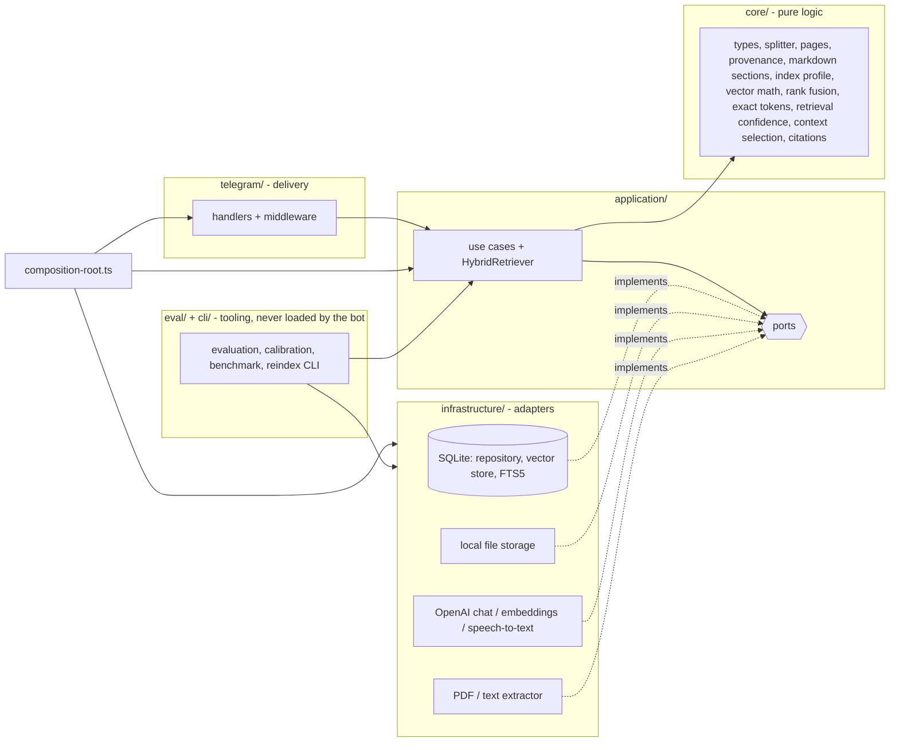
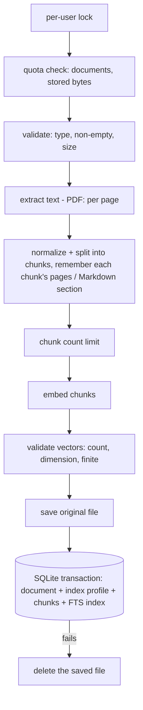

# Architecture

Dependencies point inwards: the application layer only knows ports (interfaces), never SQLite, OpenAI, the filesystem or Telegram. `src/composition-root.ts` is the single place where concrete adapters are created and injected. `test/architecture.test.ts` enforces the import rules (and that the bot's runtime never imports evaluation code).



```text
src/
  index.ts              entry point of the bot: load config, build the app, run it
  composition-root.ts   creates adapters once and injects them (bot + the reindex tool)
  lifecycle.ts          start polling, graceful shutdown (SIGINT/SIGTERM)
  cli/                  command-line tools: reindex, eval-retrieval (also eval:confidence), eval-diff, bench-retrieval
  config/               environment parsing in independent sections (zod); each command loads only what it needs
  core/                 pure logic, no I/O: types, text splitter (with offsets), page + Markdown-section provenance,
                        index profile, cosine similarity + vector codec, rank fusion (RRF) + exact-token bonus,
                        technical-token detection, retrieval signals + confidence gate, context selection,
                        chunk-overlap trimming, FTS query builder, citation checks and formatting
  application/
    hybrid-retriever.ts query embedding -> semantic + lexical search -> RRF -> load -> exact-token bonus
                        -> evidence signals -> confidence gate -> context selection
    prepare-index.ts    extract -> split -> provenance -> embed (shared by ingestion and re-chunking)
    assess-index.ts     compares a document's recorded recipe with the configured one
    ports/              DocumentRepository, VectorStore, IndexMaintenance, FileStorage, ChatModel,
                        EmbeddingsProvider, SpeechToText, DocumentTextExtractor
    prompts/            chat messages (system / user roles) for answering and summarizing
    use-cases/          ingest, answer, list, summarize, delete, reindex (re-embed), rechunk, run-reindex
    check-index-compatibility.ts   startup diagnostic for stale indexes
  infrastructure/
    sqlite/             connection, migrations, repository, vector store (vectors + FTS5), index maintenance
    storage/            local file storage
    openai/             chat model, embeddings, speech-to-text adapters
    documents/          PDF (per page) / MD / TXT text extraction
  eval/                 evaluation: metrics, answerability, calibration, dataset, harness, runner, comparison,
                        baseline, report, export, diff, live-run plan, benchmark
  telegram/             bot factory, routing, handlers, middleware (errors, rate limit), downloads, UI text
  shared/               logger, errors, rate limiter, keyed mutex, small utilities
eval/                   fixture corpus, questions (JSONL, versioned), comparison grids, baseline minimums, offline embedding lexicon
docs/                   this file, rag.md, evaluation.md
test/                   Vitest suites using fakes for the ports and in-memory SQLite
```

**Retrieval boundary.** `HybridRetriever` was inspected for a split into "retrieval" and "policy" and left as one class: `rank()` (search, fusion, loading, exact-token bonus, evidence signals) and `retrieve()` (adds the gate and context selection) share one set of dependencies and one ordering of steps, while the *decisions* already live in pure core functions (`assessRetrievalConfidence`, `selectContext`, `boostExactMatches`) that are tested and calibrated independently. A separate service would have been a wrapper. The evaluation uses `rank()` + `select()` + the same pure gate, so it measures the production path without a copy of it.

## Request flow

1. Telegraf receives an update; `requestLogger` and `errorBoundary` middleware wrap every handler.
2. Handlers that call OpenAI (`/ask`, plain text, `/summary`, uploads, voice) first pass the per-user rate limit.
3. A handler reads Telegram specifics (user id, command arguments, file ids), calls one use case, and formats the result as plain text, split into several messages if it exceeds Telegram's limit.
4. `errorBoundary` replies with the message of an `AppError` (written for users) or a generic message for anything unexpected. Technical details are logged, never sent.

## Ingestion flow



Everything that can fail without side effects happens first, and limits are checked before any paid embedding call. The file is only written after embeddings succeeded, document and chunks are saved atomically (the full-text index is updated by triggers in the same transaction), and the file is removed again if that last step fails. A failed upload leaves no orphan file, no document without chunks and no chunks without a document. Uploads of one user run one after another so two simultaneous uploads cannot both slip under a quota.

## Storage

- Files: `<DATA_DIR>/files/<uuid>-<sanitized name>`; database: `<DATA_DIR>/app.db` (SQLite, WAL, foreign keys on).

| Table | Purpose |
| --- | --- |
| `documents` | One row per upload: owner, names, sizes, cached summary, `index_profile` (JSON) and `index_fingerprint` |
| `document_chunks` | Chunk text, embedding (float32 BLOB), `embedding_model`, `embedding_dim`, optional provenance (`page_start` / `page_end`, `page_label_start` / `page_label_end`, `section_path` as a JSON list of headings); stable integer key `seq`; `UNIQUE (document_id, chunk_index)`; `ON DELETE CASCADE` |
| `chunk_fts` | FTS5 external-content index over `document_chunks.content` (`unicode61`, diacritics folded), kept in sync by triggers |

Migrations use `PRAGMA user_version` (`src/infrastructure/sqlite/migrations.ts`); each runs in its own transaction; a database written by a newer version is refused.

| Version | Change |
| --- | --- |
| 1 | baseline schema |
| 2 | track `embedding_model` / `embedding_dim`, unique chunk positions, query-shaped indexes |
| 3 | embeddings stored as float32 **BLOB** instead of JSON text; chunks get a stable integer `seq` key |
| 4 | `chunk_fts` FTS5 index + sync triggers; existing chunks are indexed during the migration |
| 5 | `documents.index_profile` / `index_fingerprint`, `document_chunks.page_start` / `page_end` (columns only, no data rewritten) |
| 6 | `document_chunks.section_path`, `page_label_start`, `page_label_end` - nullable, **no data rewritten**: older chunks have no section or label until their document is re-chunked, and a reader never invents one |

**Vector BLOB format** (`src/core/vectors.ts`): the IEEE-754 binary32 value of every dimension, 4 bytes each, **little-endian**, no header; the dimension is in `embedding_dim`. Values that do not fit float32 are rejected like `NaN`/`Infinity`. Scanning float32 blobs instead of JSON text cut a 5000 x 1536 scan from ~264 ms to ~46-75 ms and vectors are ~5x smaller. The scan is still brute force over the user's chunks - fine for thousands of chunks; the `VectorStore` port is the seam for an ANN index later.

## Index profile, re-embedding and re-chunking

Every document stores the **recipe it was indexed with** (`src/core/index-profile.ts`):

| Field | Changes when |
| --- | --- |
| `embeddingModel`, `embeddingDimension` | `OPENAI_EMBEDDINGS_MODEL` changes |
| `chunkSize`, `chunkOverlap` | `CHUNK_SIZE` / `CHUNK_OVERLAP` change |
| `chunkingVersion` | `splitText` behaves differently (a constant; bump it with the change) |
| `extractorVersion` | extraction output changes - per file type: `text-v1`, `markdown-sections-v1`, `pdf-pages-v2` |

Query-time settings (`RETRIEVAL_*`, `MIN_SIMILARITY_SCORE`) are not part of it: they can change at any time without making stored data stale.

| Kind | Meaning | Effect on search | Fixed by |
| --- | --- | --- | --- |
| embedding | other model / dimension, or unreadable vectors | skipped by semantic search (still found by keywords) | `npm run reindex` (re-embed) |
| chunking | other chunk size, overlap or algorithm version | none | `npm run reindex -- --rechunk` |
| extractor | extraction changed (PDFs without pages, Markdown without sections) | none; citations fall back to chunk numbers | `npm run reindex -- --rechunk` |

Documents indexed before profiles existed have *unknown* chunk size/overlap; unknown is never reported as a change. The bot logs one warning at startup with the counts; it never re-indexes by itself. Re-chunking reads the stored file, extracts, splits, embeds, validates, and replaces chunks + profile in **one transaction**; any failure leaves the previous index untouched.

```bash
npm run reindex -- --dry-run              # why is each document stale? No OpenAI calls, no API key
npm run reindex                           # re-embed documents with outdated embeddings
npm run reindex -- --rechunk              # also rebuild chunk-layout / extractor-stale documents from their files
npm run reindex -- --all --rechunk        # rebuild everything
npm run reindex -- --document <id> [--rechunk]
```

Documents are processed one at a time; one failure is recorded and the run continues; the exit code is non-zero if any document failed.

## Limits and safeguards

| Safeguard | Default | Behaviour |
| --- | --- | --- |
| `MAX_DOCUMENTS_PER_USER` | 100 | Upload rejected with a clear message before any extraction or embedding |
| `MAX_STORAGE_BYTES_PER_USER` | 200 MB | Sum of a user's original file sizes plus the new file |
| `MAX_CHUNKS_PER_DOCUMENT` | 2000 | Checked after splitting, before paying for embeddings; also applies when re-chunking |
| `RATE_LIMIT_REQUESTS` per `RATE_LIMIT_WINDOW_MS` | 10 per 60 s | Sliding window per Telegram user, in memory, for questions, summaries, uploads and voice messages |

The rate limiter is in memory and per process on purpose (single-process long-polling bot, no Redis); it sits behind a small boundary (`src/shared/rate-limiter.ts`, injectable clock). Ingestion of one user is serialized; summaries are computed once per document at a time; everything else relies on SQLite transactions.

## Observability

Every question logs one concise structured line: selected chunk count, stage timings and total duration. An abstained question logs `Question not answered: insufficient evidence` with the reason and the evidence numbers (no text). Logs never contain document text, embeddings, keys or tokens; the question itself only with `LOG_QUESTIONS=true`. With `RAG_DEBUG=true` each answered question also logs candidate counts, selected chunk ids with `semanticRank` / `lexicalRank` / fused rank, why candidates were skipped, the confidence decision with its signals, and the context size - ids and numbers only.
